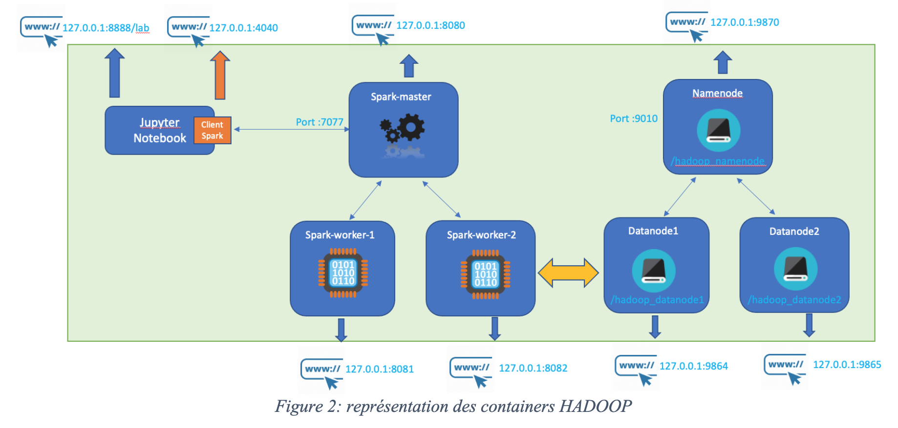

# Big Data Analytics: Practicals

## Configuration

1. Install [Docker Desktop](https://www.docker.com/products/docker-desktop/). 

    > Verify the installation following the [Docker Tutorial](https://docs.docker.com/get-started/#start-the-tutorial)

2. Clone the practicals repository:

    ```sh
    git clone https://github.com/javieraespinosa/big-data-analytics-practicals.git
    cd big-data-analytics-practicals
    ```

3. Pull the required docker images:

    ```sh
    docker compose pull
    ```

4. Test the jupyter image. 

    ```sh
    docker compose up jupyter
    ```

5. Visit [localhost:8888](http://localhost:8888). If you see the Jupyter Lab, you are ready to go.

## Hadoop/Spark Cluster

The practicals assume a Hadoop/Spark cluster with the following architecture: 



* Start the cluster as follows:

    ```sh
    docker compose up jupyter
    ```

## Credits

The original material in this repository was developed by [Osman AIDEL](https://annuaire.in2p3.fr/54-8735/osman-aidel), a research engineer from IN2P3 CNRS Computing Center.
